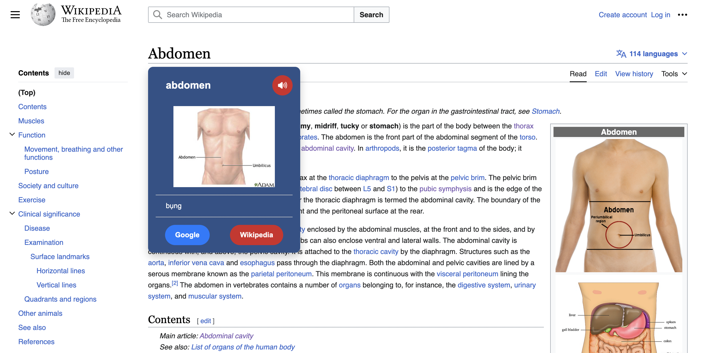
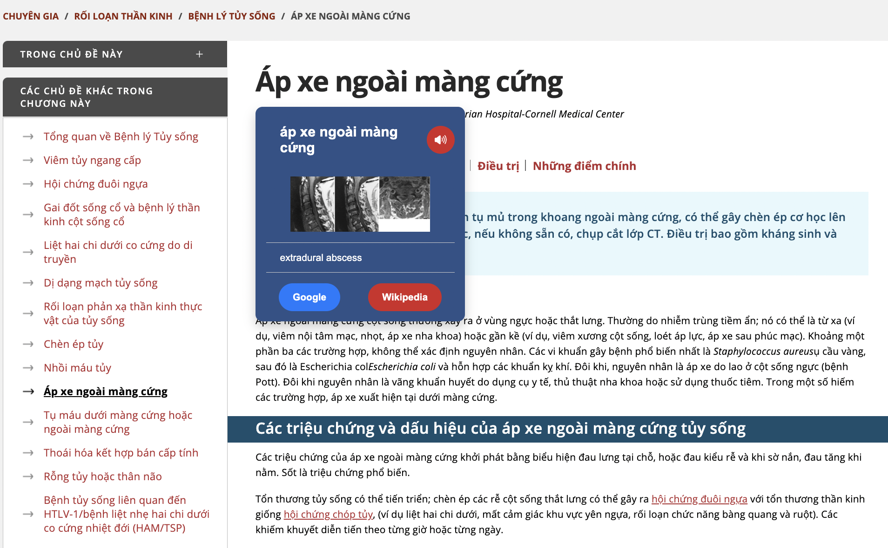

# Medical Dictionary 🏥📖

**MedDict** is a medical dictionary made by VinUnians for College of Health Sciences (CHS) students & faculties in VinUniversity. The dictionary is curated by Professor Huynh Dinh Chien, faculty of CHS at VinUniversity. 

## 🔍 Table of contents 
- [Medical Dictionary 🏥📖](#medical-dictionary-)
  - [🔍 Table of contents](#-table-of-contents)
  - [✨ Features](#-features)
    - [For end-users](#for-end-users)
  - [🧐 Usage](#-usage)
    - [Search with the MedDict plugin](#search-with-the-meddict-plugin)
  - [👨‍🔧 Installation](#-installation)
    - [Setup](#setup)
      - [MedDict Website](#meddict-website)
    - [Installation of chrome extension](#installation-of-chrome-extension)
  - [👩‍💻 Development](#-development)
  - [📄 License](#-license)
  - [🙏 Acknowledgement](#-acknowledgement)

## ✨ Features

### For end-users

- With the MedDict plugin, you can search for words directly from your browser!
- Search for both English/Vietnamese medical words to receive the corresponding words in the other language by highlight words in your webdite. 
- Provide sample illustrations and pronunciations for the words.
- Suggest words to the dictionary managers.


## 🧐 Usage 

### Search with the MedDict plugin

With the [MedDict plugin](https://github.com/linhledieu/MedDict-highlighter), you can search for words directly from your browser!

More interestingly, you DON'T need to specify source/target language. The plugin will automatically do the ✨ magic for you!






## 👨‍🔧 Installation 

### Setup 

#### MedDict Website

1. Cloning the project with:
```bash
$ git clone https://github.com/linhledieu/MedDict-highlighter.git
```
2. Install the dependencies:

```sh
npm i
```

### Installation of chrome extension

1. Open your Chrome browser and navigate to chrome://extensions. 
2. Enable Developer Mode by clicking the toggle switch next to Developer mode. 
3. Click the Load unpacked button and select this directory
   
## 👩‍💻 Development

Please refer to [DEVELOPMENT.md](./DEVELOPMENT.md) for more information.

## 📄 License

This project is using MIT License. 

## 🙏 Acknowledgement 

We want to say thank to COMP2030 - Software Construction's Instructor Team for helping us during the course, as well as Professor Huynh Dinh Chien & Mr. Hoang Mai Duy with their supports during the project. 